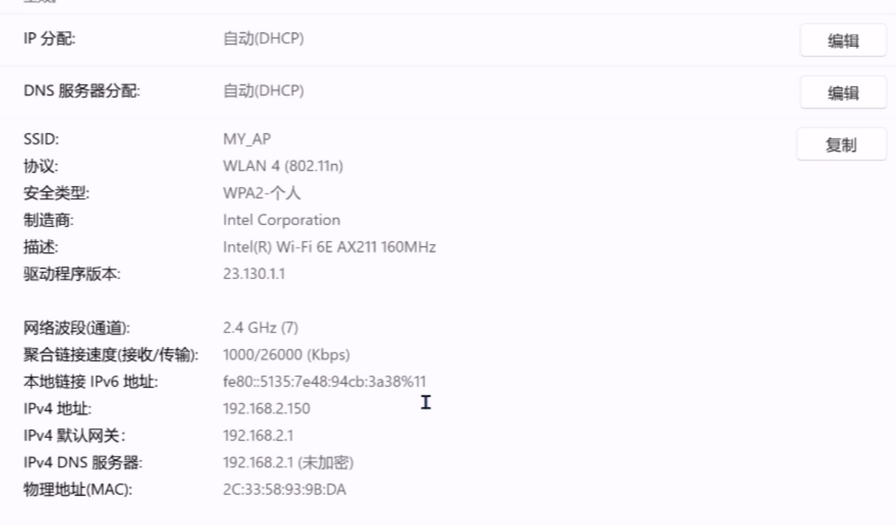

# 通晓开发板基础外设开发——wifi AP模式

本示例将演示如何在通晓开发板上开启wifi的AP模式


## WiFi ssid 和密码设置

```c
#define AP_SSID     "MY_AP"
#define AP_PWD      "12345678"
```

这是AP启动之后的ssid和密码。


### 主要代码分析

创建AP线程任务 设置ssid-->设置密码-->启动AP模式
```c
void wifi_ap_mode(void *args)
{
    //设置wifi的ssid和密码
    set_wifi_config_ssid(printf, AP_SSID);
    set_wifi_config_passwd(printf, AP_PWD);
    set_wifi_config_mode(printf, "AP");
    SetApModeOn();

}

//wifi ap 案例
void wifi_ap_example(void)
{
    unsigned int ret = LOS_OK;
    unsigned int thread_id;
    TSK_INIT_PARAM_S task = {0};
    printf("%s start ....\n", __FUNCTION__);

    task.pfnTaskEntry = (TSK_ENTRY_FUNC)wifi_ap_mode;
    task.uwStackSize = 10240;
    task.pcName = "wifi_ap";
    task.usTaskPrio = 24;
    ret = LOS_TaskCreate(&thread_id, &task);
    if (ret != LOS_OK)
    {
        printf("Falied to create wifi_ap ret:0x%x\n", ret);
        return;
    }
}

APP_FEATURE_INIT(wifi_ap_example);
```

### 运行结果

示例代码编译烧录代码后，按下开发板的RESET按键，通过串口助手查看日志，串口显示如下：

```c
entering kernel init ......
hilog will init.
[MAIN:D]Main:LOS_Start.
Entering scheduler
OHOS # hiview init success.wifi_ap_example start
[FLASH:I]FlashInit:blockSize 4096,blockStart 0,blockEnd 8388608
APssid:MY_AP
[FLASH:E]FlashInit:id 0,controller has already been initialized
APpasswd:12345678
[FLASH:E]FlashInit:id 0,controller has already been initialized
mode:AP
[config_network:D]rknetwork SetApModeOn start...
[FLASH:E]FlashInit: id 0, controller has already been initialized
[config_network:D]rknetwork EnableHotspot ...
[wifi_api:D]ip=192.168.2.1 gw=192.168.2.1 mask=255.255.255.0
[wifi_api:D]HWADDR (00:dc:b6:90:01:00)
[bcore_device:E]start bb ...
[bcore_device:E]start bb done
[wifi_api:D]netif setup
[wifi_api_internal:D]Start AP (SSID=MY_AP channel=7)
[wifi_api_internal:D]derive psk ...
[wifi_api_internal:D]derive pskdone
[wifi_dhcp:D]lann_ipaddr:192.168.2.1
[wifi_dhcp:D]lann_mask:255.255.255.0
[config_network:D]rknetworkEnableHotspotdone
[wifi_dhcp:D][DHCPD]: discover packet ...
[wifi_dhcp:D][DHCPD]: request packet ..
[wifi_dhcp:D][DHCPD]: assign IP 192.168.2.150
```

使用手机或电脑连接该热点,能够正常连接,并且显示对应的IP。


