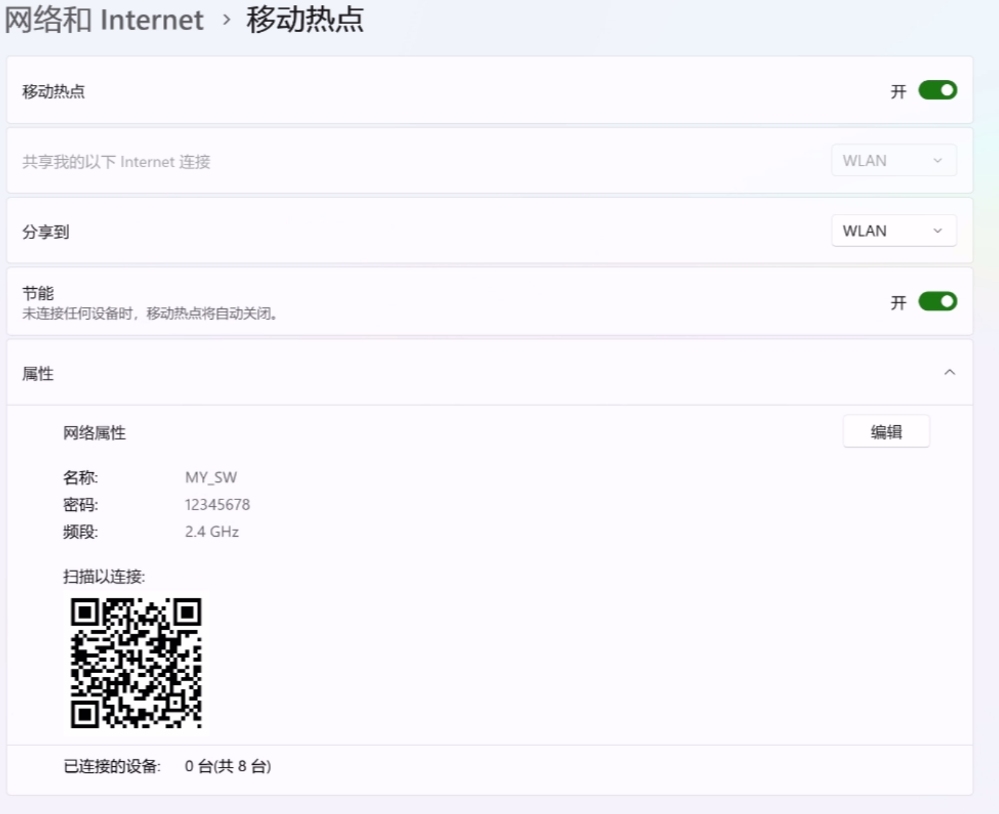
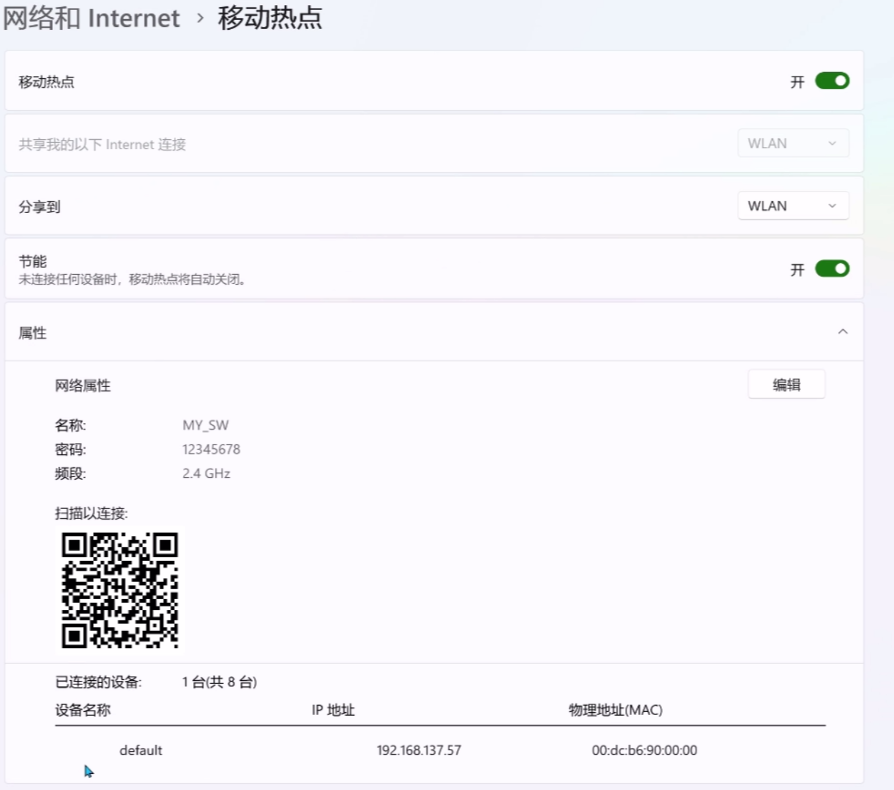

# 通晓开发板基础外设开发——wifi STA模式

本示例将演示如何在通晓开发板上开启wifi的STA模式


## WiFi ssid 和密码设置

```c
#define ROUTE_SSID      "MY_SW"
#define ROUTE_PASSWORD  "12345678"
```

这是wifi将要连接的热点的ssid和密码。


### 主要代码分析

创建AP线程任务 配置ssid-->配置密码-->启动STA模式
```c

void wifi_sta_mode(void *args)
{
    //重置MAC地址
    uint8_t mac_address[6] = {0x00, 0xdc, 0xb6, 0x90, 0x00, 0x00};

    FlashInit();
    VendorSet(VENDOR_ID_WIFI_MODE, "STA", 3); // 配置为Wifi STA模式
    VendorSet(VENDOR_ID_MAC, mac_address, 6); // 多人同时做该实验，请修改各自不同的WiFi MAC地址
    VendorSet(VENDOR_ID_WIFI_ROUTE_SSID, ROUTE_SSID, sizeof(ROUTE_SSID));
    VendorSet(VENDOR_ID_WIFI_ROUTE_PASSWD, ROUTE_PASSWORD, sizeof(ROUTE_PASSWORD));

    SetWifiModeOff();
    SetWifiModeOn();
}

//wifi sta 案例
void wifi_sta_example(void)
{
    unsigned int ret = LOS_OK;
    unsigned int thread_id;
    TSK_INIT_PARAM_S task = {0};
    printf("%s start ....\n", __FUNCTION__);

    task.pfnTaskEntry = (TSK_ENTRY_FUNC)wifi_sta_mode;
    task.uwStackSize = 10240;
    task.pcName = "wifi_sta";
    task.usTaskPrio = 24;
    ret = LOS_TaskCreate(&thread_id, &task);
    if (ret != LOS_OK)
    {
        printf("Falied to create wifi_sta ret:0x%x\n", ret);
        return;
    }
}

APP_FEATURE_INIT(wifi_sta_example);
```

### 运行结果

首先在电脑或手机上开启WIFI热点,选取2.4G频段:



示例代码编译烧录代码后，按下开发板的RESET按键，通过串口助手查看日志，串口显示如下：

```c
entering kernel init..
hilog will init.
[MAIN:D]Main:LOS_Start..
Entering scheduler
OHOS # hiview init success.wifi_sta_example start
[FLASH:I]FlashInit:blockSize 4096，blockStart 0,blockEnd 8388608
[config_network:D]rknetwork wifi is inactive
[FLASH:E]FlashInit:id 0,controller has already been initialized
[config_network:D]rknetwork SetWifiModeOn
[config_network:D]rknetwork g_wificonfig.ssid MY_SW
[config_network:D]rknetworkg_wificonfig.psk12345678
[wifi_api:D]ip=192.168.2.1 gw=192.168.2.1 mask=255.255.255.0
[wifi_api:D]HWADDR (00:dc:b6:90:00:00)
[bcore_device:E]start bb
[bcore_device:E]start bbdone
[wifi_api:D]netif setup
[config_network:D]rknetwork EnableWifi done
[config_network:D]rknetwork SetWifiScan after g_wificonfig.bssid:
[wifi_api_internal:D]Connect to (SSID=MY_SW)
[wifi_api_internal:D]derive psk .
[wifi_api_internal:D]derive psk done
[wifi_api_internal:D]recovery process
[wifi_api_internal:D]AP BSSID (2e:33:58:93:9b:da)
[config_network:I]ConnectTo (MY_SW) done
[config_network:D]rknetwork IP (192.168.137.57)
[config_network:D]network GW (192.168.137.1)
[config_network:D]network NETMASK(255.255.255.0)
[WIFI_DEVICE:E]1onum:0127.0.0.1
[WIFI_DEVICE:E]w 1 num:1 192.168.137.57
[config_network:D]set networkGW
[config_network:D]network GW (192.168.137.1)
[config_network:D]network NETMASK (255.255.255.0)
```

开发板连接热点之后,电脑端会显示对应的IP。


