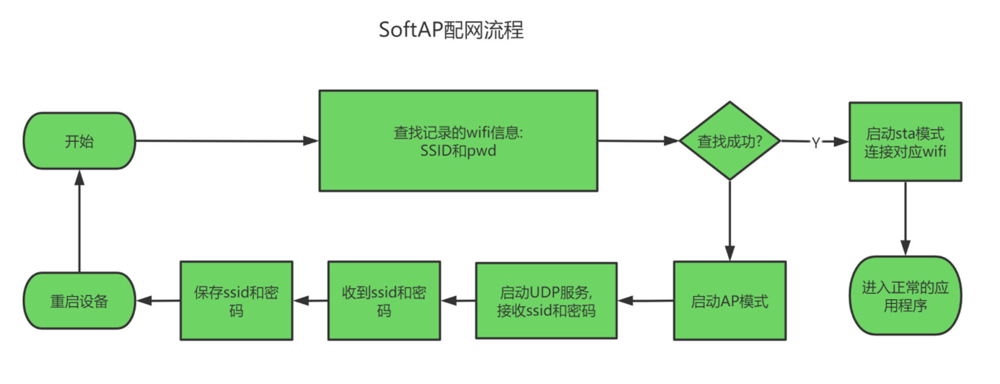
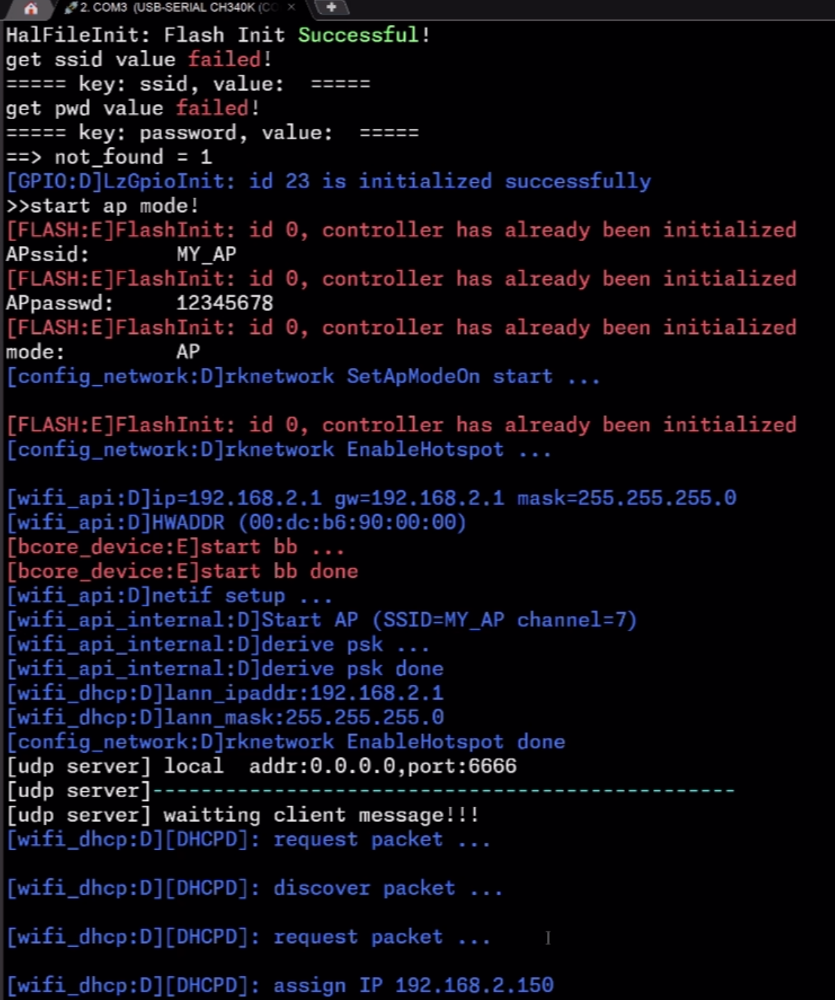
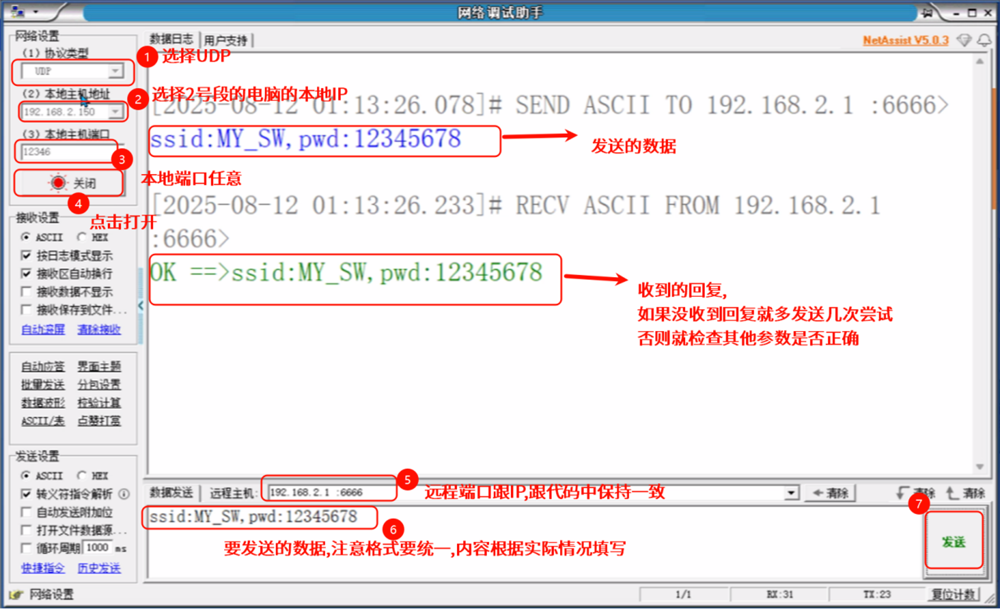
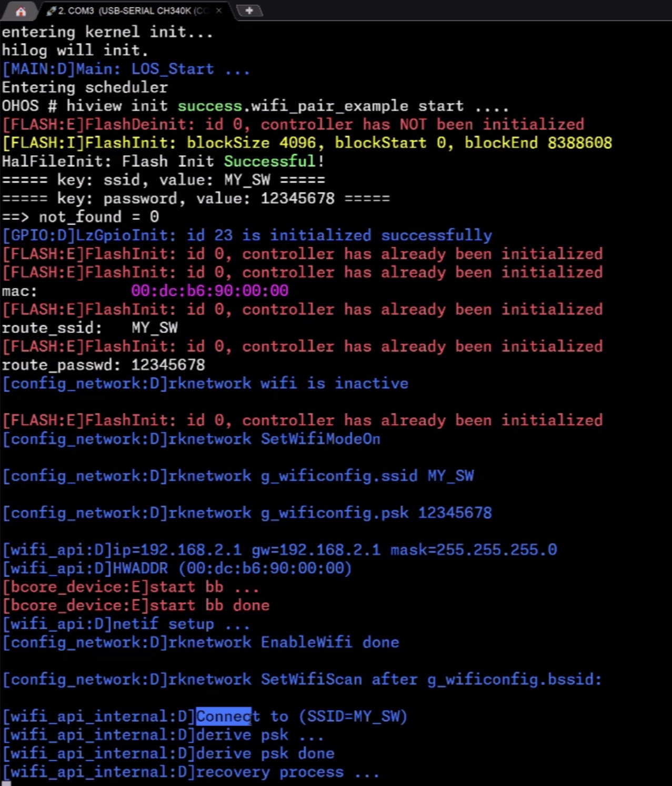

# 通晓开发板基础外设开发——wifi AP配网

本示例将演示如何在通晓开发板上使用wifi进行AP配网


## AP配网的流程

要使用AP配网,首先了解AP配网的流程:



本案例需结合KV存储实现wifi密码的保存和读取。

## 程序设计


### 主要代码分析

首先启动wifi的线程,根据是否在kv存储内找到存储的wifi信息决定开启ap热点还是进入sta模式:
```c
void wifi_pair_example(void)
{
    unsigned int ret = LOS_OK;
    unsigned int thread_id;
    TSK_INIT_PARAM_S task = {0};
    printf("%s start ....\n", __FUNCTION__);

    task.pfnTaskEntry = (TSK_ENTRY_FUNC)key_process;
    task.uwStackSize = 10240;
    task.pcName = "key_process";
    task.usTaskPrio = 24;
    ret = LOS_TaskCreate(&thread_id, &task);
    if (ret != LOS_OK)
    {
        printf("Falied to create AP_task ret:0x%x\n", ret);
        return;
    }
    int find = loadWifiInfo(g_ssid,g_pwd);

    if(find == 0){
        task.pfnTaskEntry = (TSK_ENTRY_FUNC)AP_task;
        task.uwStackSize = 10240;
        task.pcName = "wifi_ap";
        task.usTaskPrio = 24;
        ret = LOS_TaskCreate(&thread_id, &task);
        if (ret != LOS_OK)
        {
            printf("Falied to create AP_task ret:0x%x\n", ret);
            return;
        }
        return;
    }else{
        task.pfnTaskEntry = (TSK_ENTRY_FUNC)sta_process;
        task.uwStackSize = 10240;
        task.pcName = "sta_process";
        task.usTaskPrio = 24;
        ret = LOS_TaskCreate(&thread_id, &task);
        if (ret != LOS_OK)
        {
            printf("Falied to create AP_task ret:0x%x\n", ret);
            return;
        }
        return;
    }

}

APP_FEATURE_INIT(wifi_pair_example);
```

进入AP模式之后,使用UDP接收对端发的数据,将数据解析之后得到wifi的ssid和密码,先讲对应的数据保存起来,然后开发板重启:
```c


void udp_server_msg_handle(int fd)
{
    char recvBuf[512] = { 0 };
    char sendBuf[512] = { 0 };
    socklen_t len;
    int ret = 0;
    int count = 0;
    struct sockaddr_in client_addr = {0};

    while (1)
    {
        memset(recvBuf, 0, sizeof(recvBuf));
        len = sizeof(client_addr);
        printf("[udp server]------------------------------------------------\n");
        printf("[udp server] waitting client message!!!\n");
        count = recvfrom(fd, recvBuf, sizeof(recvBuf), 0, (struct sockaddr*)&client_addr, &len);       //recvfrom是阻塞函数，没有数据就一直阻塞
        if (count == -1)
        {
            printf("[udp server] recieve data fail!\n");
            LOS_Msleep(3000);
            break;
        }
        printf("[udp server] remote addr:%s port:%u\n", inet_ntoa(client_addr.sin_addr), ntohs(client_addr.sin_port));
        printf("[udp server] rev:%s\n", recvBuf);
        
        /**
        *解析收到的数据,格式:ssid:xxxx,pwd:yyyy
        */
        char *ssid_str = strstr(recvBuf,"ssid:");
        char *comma_str = strstr(recvBuf,",pwd:");

        if((ssid_str != NULL) && (comma_str != NULL)){
            char ssid[32]={0};
            char pwd[32]={0};

            memcpy(ssid,ssid_str+5,comma_str-(ssid_str+5));
            memcpy(pwd,comma_str+5,recvBuf+strlen(recvBuf)-(comma_str+5));

            printf("==>> {{{%s,%s}}}}\n",ssid,pwd);

            sprintf(sendBuf,"OK ==>%s \n",recvBuf);
            ret = sendto(fd, sendBuf, strlen(sendBuf), 0, 
                (struct sockaddr *)&client_addr, sizeof(client_addr));
            if (ret < 0) {
                printf("UDP server send failed!\r\n");
                return -1;
            }
            //保存ssid和密码信息
            saveWifiInfo(ssid,pwd);
            //重启设备
            RebootDevice(3);
        }

    }
    lwip_close(fd);
}

int wifi_udp_server(void* arg)
{
    int server_fd, ret;

    while(1)
    {
        server_fd = socket(AF_INET, SOCK_DGRAM, 0); //AF_INET:IPV4;SOCK_DGRAM:UDP
        if (server_fd < 0)
        {
            printf("create socket fail!\n");
            return -1;
        }

        /*设置调用close(socket)后,仍可继续重用该socket。
        调用close(socket)一般不会立即关闭socket，而经历TIME_WAIT的过程。*/
        int flag = 1;
        ret = setsockopt(server_fd, SOL_SOCKET, SO_REUSEADDR, &flag, sizeof(int));
        if (ret != 0) {
            printf("[CommInitUdpServer]setsockopt fail, ret[%d]!\n", ret);
        }
        
        struct sockaddr_in serv_addr = {0};
        serv_addr.sin_family = AF_INET;
        //IP地址，需要进行网络序转换，INADDR_ANY：本地地址
        serv_addr.sin_addr.s_addr = htonl(INADDR_ANY); 
         //端口号，需要网络序转换
        serv_addr.sin_port = htons(SERVER_PORT);      
        /* 绑定服务器地址结构 */
        ret = bind(server_fd, (struct sockaddr*)&serv_addr, sizeof(serv_addr));
        if (ret < 0)
        {
            printf("socket bind fail!\n");
            lwip_close(server_fd);
            return -1;
        }
        printf("[udp server] local  addr:%s,port:%u\n", inet_ntoa(wifiinfo.ipAddress), ntohs(serv_addr.sin_port));

        udp_server_msg_handle(server_fd);   //处理接收到的数据
        LOS_Msleep(1000);
    }
}

int AP_task(WifiLinkedInfo *info)
{
    printf(">>start ap mode!\n");
    set_wifi_config_ssid(printf, "MY_AP");
    set_wifi_config_passwd(printf, "12345678");
    set_wifi_config_mode(printf, "AP");
    SetApModeOn();

    wifi_udp_server(NULL);
}

```


然后系统开机之后找到WiFi信息,进入sta模式,连接了wifi ,进入正常工作模式:
```c
void sta_process(void *args)
{
    unsigned int ret = LOS_OK;
   
    WifiLinkedInfo info;

    uint8_t mac_address[6] = {0x00, 0xdc, 0xb6, 0x90, 0x00, 0x00};
    FlashInit();

     set_wifi_config_mac(printf, mac_address);
     set_wifi_config_route_ssid(printf, g_ssid);
     set_wifi_config_route_passwd(printf, g_pwd);

    SetWifiModeOff();
    SetWifiModeOn();

    while(get_wifi_info(&info) != 0) ;

    while(1)
    {
        //联网成功之后 运行正常的AP模式程序,比如物联网IoT
        printf("sta mode...");
        LOS_Msleep(1000);
    }
}
```

同时开启了按键扫描线程,但按键长按超过5s时,清楚wifi信息,并重启,相当于进入恢复出厂模式:
```c
#include "iot_gpio.h"
#include "wifi_store.h"

#define GPIO_KEY_RESET        GPIO0_PC7
#define PRESSED     1
#define NO_PRESSED  0

void key_process()
{
    unsigned int ret;

    /* 初始化引脚为GPIO */
    IoTGpioInit(GPIO_KEY_RESET);
    /* 引脚配置为输入 */
    IoTGpioSetDir(GPIO_KEY_RESET, IOT_GPIO_DIR_IN);

    int is_pressed = NO_PRESSED;
    int press_count = 0;
    while (1)
    {
        IotGpioValue val;
        IoTGpioGetInputVal(GPIO_KEY_RESET, &val);
        if((val == 0) &&(is_pressed == NO_PRESSED)) {

            //消除抖动
            LOS_Msleep(10);
            IoTGpioGetInputVal(GPIO_KEY_RESET, &val);
            if(val == 0){
                is_pressed = PRESSED;
                printf("pressed\n");
              
            }
        }else if((val == 1) &&(is_pressed == PRESSED)){
                is_pressed = NO_PRESSED;
                printf("no pressed\n");
                int press_count = 0;
        }else if((val == 0) &&(is_pressed == PRESSED)){//长按
            press_count ++;
            /*每次50ms,100次=5s */
            if(press_count>=100){
                printf("start to reboot");
                /*重启前清除配网信息,和其他需要清除的内容*/
                clearWifiInfo();
                    //重启设备
                RebootDevice(3);

            }

        }
        
        /* 睡眠1秒 */
        LOS_Msleep(50);
    }
}
```

## 编译调试

### 修改 BUILD.gn 文件

修改 `vendor\isoftstone\rk2206\sample 路径下 BUILD.gn 文件，指定 `wifi_udp_example` 参与编译。

```r
"./b16_wifi_pair:wifi_pair",
```

修改 `device/rockchip/rk2206/sdk_liteos` 路径下 Makefile 文件，添加 `-lwifi_udp_example` 参与编译。

```r
hardware_LIBS = -lhal_iothardware -lhardware -lwifi_pair
```

### 运行结果

示例代码编译烧录代码后，按下开发板的RESET按键，通过串口助手查看日志，串口显示如下：



开机并没有找到WiFi信息,所以开启AP模式.

通过网络调试助手发送消息，通晓开发板会打印以下log。




